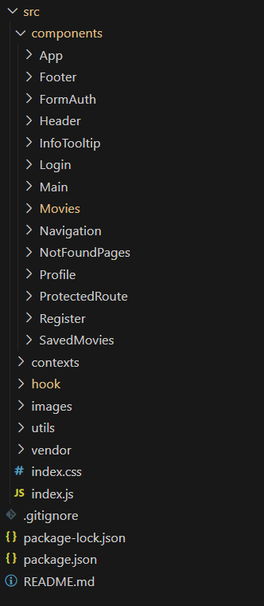

<h1 align="center">"Movies-explorer</h1>
<h3 align="center">Дипломный проект</h3>
<h4 align="center">Frontend part</h4>

## Описание проекта

Дипломный проект от [Я.Практикум](https://practicum.yandex.ru/web/). Визуальная и функциональная часть приложения.

Бэкенд расположен в директории `movies-explorer-api/`

## Функционал:

- Поиск фильмов;
- Добавление и удаление фильмов в/из "Сохранённые фильмы";
- Редактирование профиля пользователя;
- Фильтрация фильмов по длительности (короткометражки до 40 минут);
- Регистрация и авторизация пользователя;

Данный проект был разделен на 2 основных частей:

1. Вёрстка и JSX

2.  Функциональность на «React» и JS

<h3 align="center">1. Вёрстка и JSX</h3>

К данному этапу основными требованиями были:
- Вёрстка по [макету](https://disk.yandex.ru/d/ihliJaPTjtnh7A);
- Компоненты и файловая структура;
  

<b>Демонстрация</b>

  

  

- Подготовьте необходимые маршруты:
  - по роуту `/` отображается страница «О проекте»;
  - по роуту `/movies` отображается страница «Фильмы»;
  - по роуту `/saved-movies` отображается страница «Сохранённые фильмы»;
  - по роуту `/profile` отображается страница с профилем пользователя;
  - по роутам `/signin` и `/signup` отображаются страницы авторизации и регистрации.
- HTML:
  - Разметка портирована в JSX;
  - Разметка семантическая;
  - Все классы названы по БЭМ;
  - Навигация должна работать: ни одна ссылка не ведёт «в никуда»;
- CSS:
  - Вёрстка на Flex layout и/или Grid layout;
  - Адаптивность под указанные в макете разрешения и отсутствие поломок в промежуточных значениях;
  - Шрифты подключены через @font-face;
  - Элементы правильно позиционированы;
  - Сделана микроанимация кнопок, ссылок и инпутов;
  - Использован normalize.сss;
  - Формы и плейсхолдеры стилизованы верно;
  - В разных частях проекта есть переиспользуемые блоки;
  - Все изображения оптимизированы — в том числе и .svg;
  

<b>Демонстрация</b>

  

  

<h3 align="center">2. Функциональность на «React» и JS</h3>

Второй этап дипломной работы включает в себя:
- Оформление асинхронных GET- и POST-запросов к API;;
- Написание всех запросов к нашему и стороннему API;
- Защита роутов `/saved-movies`, `/profile` и `/movies` авторизацией;
- Bспользование глобальной стейт-переменной currentUser для хранения данных о пользователе;
- Внедрение контекста через CurrentUserContext.Provider в компонент App;
- Хранение JWT-токена в localStorage или в куке;
- Обработка ошибок от API и оповещение пользователь об ошибке:
  

<b>Демонстрация</b>

  

  

- Настройка прелоадера так, чтобы он крутился, пока от сервера идёт ответ:
  

<b>Демонстрация</b>

  

  

- При нажатии по карточке переводить на ютюб-трейлер фильма:
  

<b>Демонстрация</b>

  

  

Функциональность:

- Страницы "Регистрация" и "Авторизация":
  - все поля обязательные;
  - поле email соответствует шаблону электронной почты;
  - валидация происходит моментально, а ошибки валидации выводятся под полем ввода;
  - eсли валидация не пройдена, кнопка «Зарегистрироваться» неактивна;
  - если регистрация успешна, то выводится сообщение об успешной регистрации и при ошибке регистрации - выводится сообщение об ошибке;
  - при успешной регистрации пользователь сразу авторизовывается и попадает на страницу "Фильмы";
  

<b>Демонстрация страницы "Регистрация"</b>

  

  

  

<b>Демонстрация страницы "Авторизация"</b>

  

  

- Страницы "Аккаунт":
  - при клике на кнопку "Редактировать" поля формы становнятся активны и можно вносить изменения;
  - валидация происходит моментально, а ошибки валидации выводятся под полем ввода;
  - eсли валидация не пройдена, кнопка «Сохранить» неактивна;
  - при клике на кнопку «Выйти из аккаунта» происходит редирект на главную страницу и удаление JWT из локального хранилища;
  

<b>Демонстрация</b>

  

  

- Страницы "Фильмы":
  - блок результатов появляется только после обработки запроса, если пользователь ещё ничего не искал, блока с карточками на странице нет:
  

<b>Демонстрация</b>

  

  

  - количество оображаемых карточек зависит от ширины экрана:
  

<b>Демонстрация</b>

  

  

  - кнопка «Ещё» загружает дополнительный ряд карточек, который также зависит от ширины экрана и исчезает, когда в базе данных заканчиваются фильмы для отображения:
  

<b>Демонстрация</b>

  

  

  - результаты уже выполненного запроса сохраняется в localStorage:
  

<b>Демонстрация</b>

  

  

  - кнопка "Сохранить" меняется при нажатии, а фильм попадает в "Сохранённые фильмы", при повторном нажатии фильм удаляется из списка "Сохранённые фильмы";
  

<b>Демонстрация</b>

  

  

  - осуществляется фильтрация фильмов по длительности (до 40 минут) при нажатии на кнопку "Короткометражки";
  

<b>Демонстрация</b>

  

  

## [Ссылка на сайт](https://lis.movies-explorer.nomoreparties.sbs/)

**Ссылки**

* [Ссылка на Репозиторий GitHub](https://github.com/elislis7/movies-explorer-frontend/tree/level-3)

* [Ссылка макета](https://disk.yandex.ru/d/ihliJaPTjtnh7A)

* [Ссылка на пул реквест](https://github.com/elislis7/movies-explorer-frontend/pull/2)

<h4 align="center">План по доработке проекта</h4>

- [ ] Сделать подсвечиваемые input на странице "Аккаунт";
<!-- - [ ] Сделать валидацию email; -->
<!-- - [ ] Выводить ошибку с сервера в попап; -->
  <!-- - поле name содержит только латиницу, кириллицу, пробел или дефис; КОСЯК С ВАЛИДАЦИЕЙ -->
  <!-- - [ ] доработать чтобы хедер зависил от размера экрана, так как при открытом хедере и при переходе на широкий экран отображается два хедера -->
  <!-- - [ ] прижать футер на странице фильмы -->